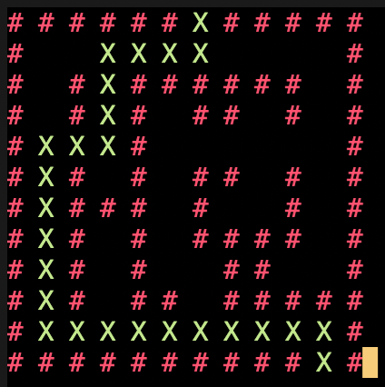

# Shortest_Path_Finder
A python program that finds the shortest path in the maze.

---

### <u>Requirements</u> :
<p>
   
    
    
    <br />
    
    <br />
    
    <br />
    
    <br />
</p>

- *NOTE*: If you are on windows Operating System type either one of the following commands in your terminal:
  ```
    pip install windows-curses
  ```
  or
  ```
    pip3 install windows-curses
  ```
  or
  ```
    python -m pip install windows-curses
  ```

---

### <u>Preview of the Output</u> :



- The Green crossed line shows the shortest path computed